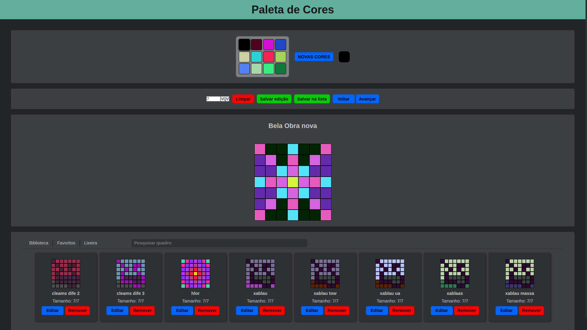
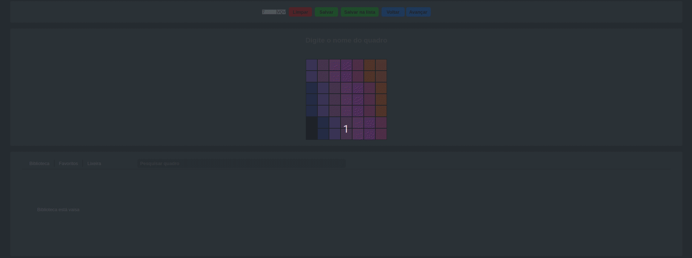

# project-pixels-art-2.0

## Sobre o Projeto

Este projeto foi baseado no projeto '[pixels-art](https://github.com/RenanFernandess/trybe-project-pixels-art)' que realizei na [Trybe](https://github.com/tryber) durante o período de fundamentos do desenvolvimento web. Meu objetivo com este projeto inicialmente era refatorar o '[pixels-art](https://github.com/RenanFernandess/trybe-project-pixels-art)' e ir um pouco além do que foi pedido para exercitar e aprender mais sobre JavaScript, DOM, HTML e CSS, mas quando começou o período de desenvolvimento front-end fiquei muito curioso em entender como o [React](https://pt-br.reactjs.org/) e [Redux](https://redux.js.org/) funcionam com isso decidi replicar algumas funcionalidades neste projeto [Pixels-art-2.0](https://github.com/RenanFernandess/project-pixels-art-2.0).

> Uma das partes que eu mais gostei de desenvolver neste projeto foi a biblioteca que carrega a quantidade de previews dos quadros de forma dinâmica de acordo com o tamanho da tela, que me deu muito trabalho além de bugs para corrigir, com isso aprendi muita coisa e gostei muito do resultado final.

### Se eu fosse fazer este projeto hoje, o que faria de diferente?
Faria muita coisa diferente no código e na estrutura do projeto, mas o principal seria:
 * Fazer tests
 * Utilizar o typeScript em vez do javaScript
 * Fazer com o paradigma funcional
 * Planejar melhor a estrutura do projeto, fazendo uma melhor organização de pastas, arquivos e funcionalidades

  
### Aprendizados:
  * Class javaScript
  * Salvar objetos e arrays no local storage
  * Unidade de medidas modernas CSS (Ex: rem, em, vw)
  * Transform CSS
  * CSS Custom properties (Variables)
  * SessionStorage
  

(<a href="#readme-top">voltar ao topo</a>)

## Construido Com
> Este projeto foi construido sem utilizar nenhum framework ou dependecia.

 * 
 * 
 * 
 

(<a href="#readme-top">voltar ao topo</a>)

## Começando

### Instalação

  1. Clonar o repositorio

    git clone git@github.com:RenanFernandess/project-pixels-art-2.0.git

  2. Entrar na pasta project-pixels-art-2.0
  
    cd ./project-pixels-art-2.0
    
  3. Instalar pacotes NPM
  
    npm install

### Executando
  
  1. iniciar o aplicativo
    
    npm start

 > **Live Server:** Caso use VScode, você pode utilizar a extensão [Live Server](https://marketplace.visualstudio.com/items?itemName=ritwickdey.LiveServer) para abrir o projeto no seu navegador, para instalá-la acesse este [link](https://marketplace.visualstudio.com/items?itemName=ritwickdey.LiveServer).

  
 

(<a href="#readme-top">voltar ao topo</a>)

 
## Uso
 ### Paleta de cores

Você pode selecionar uma cor na paleta ao clicar sobre ela, caso queira outras cores é possível alterar as cores da paleta clicando no botão "Novas cores" ou selecionar a cor que desejar no input de cores.

> Obs: por padrão a primeira cor da paleta sempre vai ser preta

### Quadro de pixels

### Biblioteca

### Salvando um quadro

### Editando um quadro

(<a href="#readme-top">voltar ao topo</a>)

## Contato

* Renan Fernandes - [Linkedin](https://www.linkedin.com/in/orenanfernandes/) - renzinestuods@gmail.com

(<a href="#readme-top">voltar ao topo</a>)

## Agradecimentos

* [Trybe](https://www.betrybe.com/)

(<a href="#readme-top">voltar ao topo</a>)

