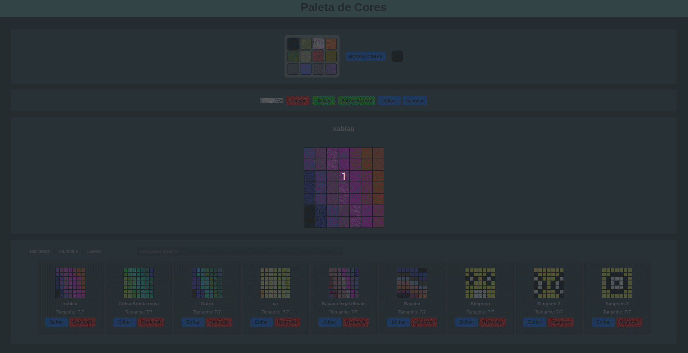
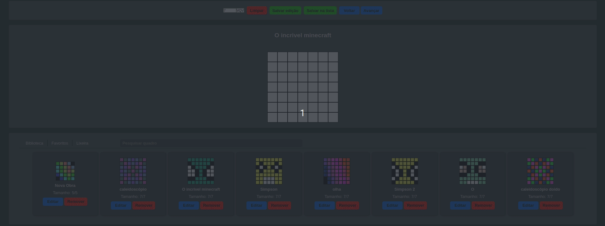

# project-pixels-art-2.0

  
Índice

  <ol>
    <li>
      <a href="#sobre-o-projeto">Sobre o Projeto</a>
      <ul>
        <li><a href="#construido-com">Construido Com</a></li>
      </ul>
    </li>
    <li>
      <a href="#começando">Começando</a>
      <ul>
        <li><a href="#instalação">Instalação</a></li>
        <li><a href="#executando">Executando</a></li>
      </ul>
    </li>
    <li><a href="#uso">Uso</a></li>
    <li><a href="#contato">Contato</a></li>
    <li><a href="#agradecimentos">Agradecimentos</a></li>
  </ol>

## Sobre o Projeto

Este projeto foi baseado no projeto '[pixels-art](https://github.com/RenanFernandess/trybe-project-pixels-art)' que realizei na [Trybe](https://github.com/tryber) durante o período de fundamentos do desenvolvimento web. Meu objetivo com este projeto inicialmente era refatorar o '[pixels-art](https://github.com/RenanFernandess/trybe-project-pixels-art)' e ir um pouco além do que foi pedido para exercitar e aprender mais sobre JavaScript, DOM, HTML e CSS, mas quando começou o período de desenvolvimento front-end fiquei muito curioso em entender como o [React](https://pt-br.reactjs.org/) e [Redux](https://redux.js.org/) funcionam com isso decidi replicar algumas funcionalidades neste projeto [Pixels-art-2.0](https://github.com/RenanFernandess/project-pixels-art-2.0).

> Uma das partes que eu mais gostei de desenvolver neste projeto foi a biblioteca que carrega a quantidade de previews dos quadros de forma dinâmica de acordo com o tamanho da tela, que me deu muito trabalho além de bugs para corrigir, com isso aprendi muita coisa e gostei muito do resultado final.

### Se eu fosse fazer este projeto hoje, o que faria de diferente?
Faria muita coisa diferente no código e na estrutura do projeto, mas o principal seria:
 * Fazer tests
 * Utilizar o typeScript em vez do javaScript
 * Fazer com o paradigma funcional
 * Planejar melhor a estrutura do projeto, fazendo uma melhor organização de pastas, arquivos e funcionalidades

  
### Aprendizados:
  * Class javaScript
  * Salvar objetos e arrays no local storage
  * Unidade de medidas modernas CSS (Ex: rem, em, vw)
  * Transform CSS
  * CSS Custom properties (Variables)
  * SessionStorage
  

(<a href="#readme-top">voltar ao topo</a>)

### Construido Com
> Este projeto foi construido sem utilizar nenhum framework ou dependecia.

 * 
 * 
 * 
 

(<a href="#readme-top">voltar ao topo</a>)

## Começando

### Instalação

  1. Clonar o repositorio

    git clone git@github.com:RenanFernandess/project-pixels-art-2.0.git

  2. Entrar na pasta project-pixels-art-2.0
  
    cd ./project-pixels-art-2.0
    
  3. Instalar pacotes NPM
  
    npm install

### Executando
  
  1. iniciar o aplicativo
    
    npm start

   após o start por padrão você será redirecionado para uma página do seu navegador com a seguinte URL:
   
    http://127.0.0.1:8080/

 > **Live Server:** Caso use VScode, você pode utilizar a extensão [Live Server](https://marketplace.visualstudio.com/items?itemName=ritwickdey.LiveServer) para abrir o projeto no seu navegador, para instalá-la acesse este [link](https://marketplace.visualstudio.com/items?itemName=ritwickdey.LiveServer).

  
 

(<a href="#readme-top">voltar ao topo</a>)

 
## Uso
 ### Paleta de cores

Você pode selecionar uma cor na paleta ao clicar sobre ela, caso queira outras cores é possível alterar as cores da paleta clicando no botão "Novas cores" ou selecionar a cor que desejar no input de cores.

> Por padrão a primeira cor da paleta sempre vai ser preta

### Quadro de pixels

  * É possível voltar e avançar as alterações feitas ao quadro clicando sobre o botão "Voltar" ou "Avançar".
  * É possível limpar o quadro clicando sobre o botão "Limpar".
  * É possível alterar o tamanho do quadro selecionando o tamanho desejado no input numérico com um valor entre 5 a 50, depois clicando no botão "VQV" para confirmar.
  * Você pode dar um nome ao seu quadro clicando sobre a mensagem "Digite o nome do quadro" após isso é só digitar o nome desejado.
  * Você pode salvar o quadro para continuar onde parou após fechar a página, para fazer isto só precisa clicar no botão salvar.

 >A cada caracter digitada para o dome ao quadro é realizado uma checagem na lista de quadros para verificar não está repetindo o nome, caso repita aparecerá a mensagem "(nome do quadro) já está sendo usado".

### Biblioteca

 * A Quantidade de previews de quadros é gerado de forma dinâmica de acordo com o tamanho da tela, caso a quantidade de previews exceda o valor máximo, serão divididos em páginas, para avançar uma página basta clicar no botão do canto direito e para voltar clicar no botão do canto esquerdo.
 * Você pode fazer a busca de um ou mais quadros pelo nome completo ou caractere inicial.
 * Você pode mover um quadro para lixeira ao clicar no botão "Remover".
 * É possível editar um quadro ao clicar sobre o botão "Editar".
 * Na lixeira você pode restaurar um quadro devolvendo ele para biblioteca clicando sobre o botão "Restaurar" ou deletar clicando sobre o botão "Apagar".

> Ao fechar a página a lixeira será limpada apagando todos os quadros contidos nela (Session Storage)

### Salvando um quadro

Para salvar um quadro na biblioteca você precisa dar um nome a ele, para adicionar o nome clique sobre a mensagem "Digite o nome do quadro" e digite o nome, quando terminar é só clicar no botão "Salvar na lista".

>A cada caracter digitada para o dome ao quadro é realizado uma checagem na lista de quadros para verificar não está repetindo o nome, caso repita aparecerá a mensagem "(nome do quadro) já está sendo usado".

### Editando um quadro

Para editar um quadro é muito simples, basta clicar no botão "Editar" no preview do quadro no qual você deseja  fazer alguma alteração, é possível modificar o quadro e também o nome, após terminar as alterações basta clicar no botão "Salvar edição".

(<a href="#readme-top">voltar ao topo</a>)

## Contato

* Renan Fernandes - [Linkedin](https://www.linkedin.com/in/orenanfernandes/) - renzinestuods@gmail.com

(<a href="#readme-top">voltar ao topo</a>)

## Agradecimentos

* [Trybe](https://www.betrybe.com/)
* [Best-README-Template](https://github.com/othneildrew/Best-README-Template)
* [http-server](https://github.com/http-party/http-server)

(<a href="#readme-top">voltar ao topo</a>)

